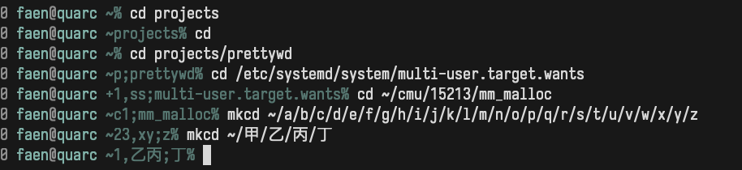

# `p`^retty^`wd`



This is a somewhat opinionated hacky little program that gives abbreviated
information about the current working directory through standard output, and is
supposed to be used as part of your `$PS1` or `$PROMPT` configuration.

I specifically made sure to process UTF-8 down to code-points, but it'll err if
your encoding is not a subset of UTF-8.

The thing doesn't have built-in help string yet, so I'll put something here.

```
prettywd [FMT [ABSPATH]]  ..._ignored

FMT: something that matches [0-9+rRcCfi]*; the digits build up base-10 numbers,
which then sets the values for the next [+rRcCfi] option; the plus sign sets
the number to "inf" (SIZE_MAX - 1), and if prefixed by a number, will persist
the "inf" count for that many options that follow; unnumbered 'f' and 'i'
increments the corresponding options (full components and initial-abbreviated
components); 'r' (start path at root) and 'c' (show count of hidden) are
boolean, are set to true with lowercase options ("rc") and false with uppercase
options ("RC"), and are unaffected by the number.

ABSPATH: an optional path beginning with a '/' that replaces the current
working directory; used for testing and debugging, mostly.
```
